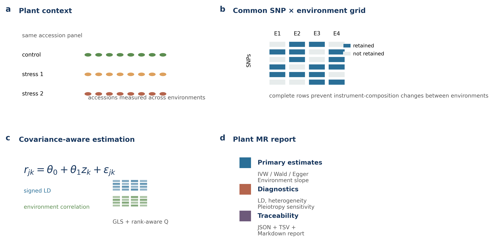
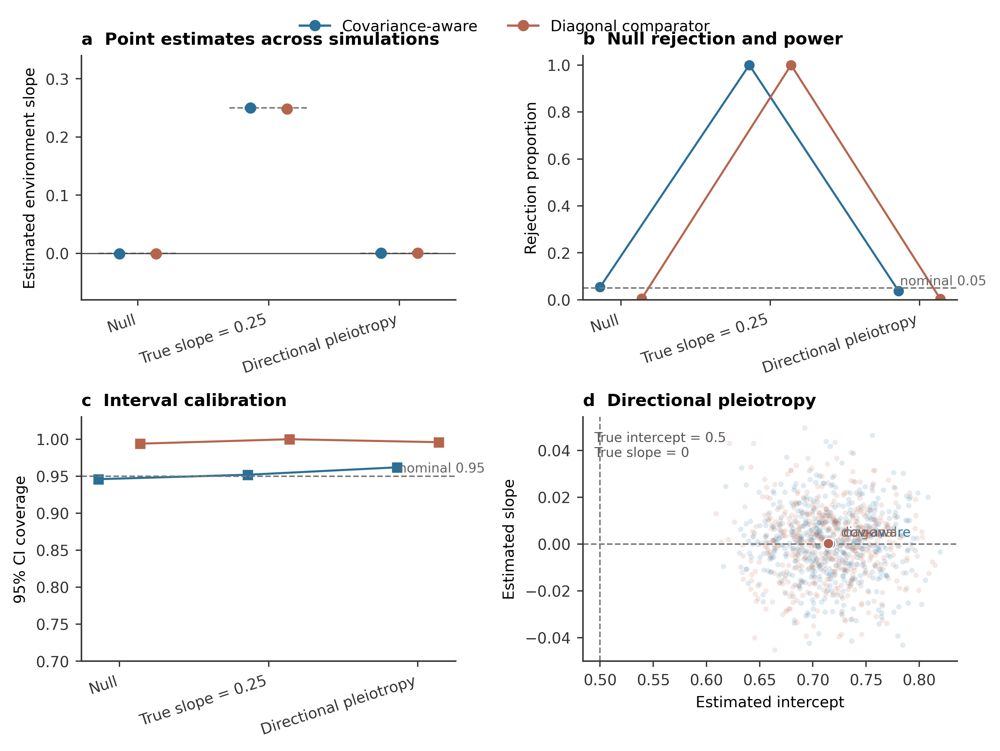
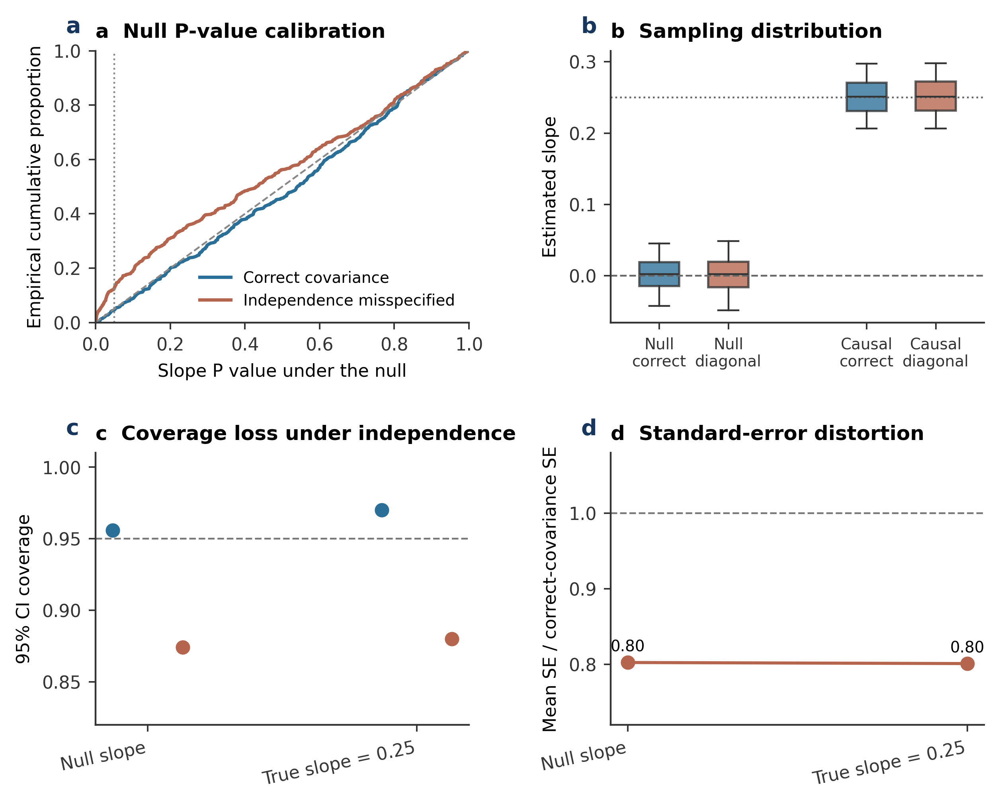
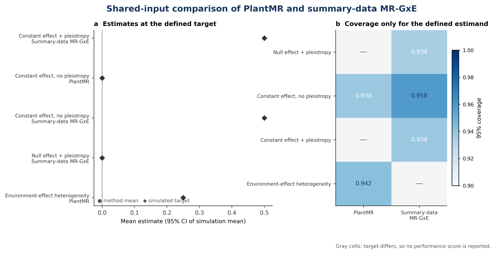
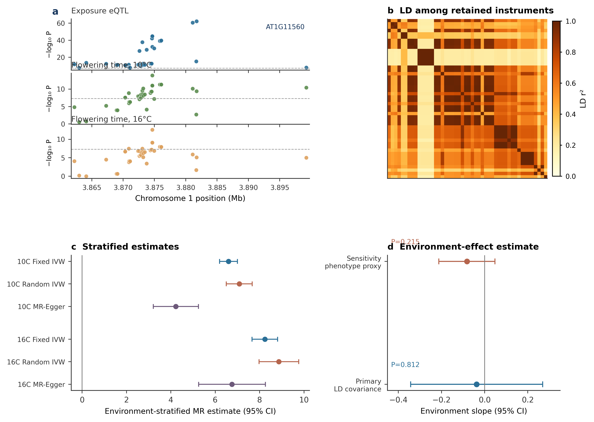

PlantMR: an auditable summary-statistics toolkit for plant and crop Mendelian randomization with environment-aware effect heterogeneity

[Author names, affiliations and corresponding-author details to be supplied]

Submission manuscript | PlantMR v1.1.0-paper | 19 September 2026

| Submission status The scientific content, analyses, source data, simulations and software snapshot are frozen. Author metadata, public repository DOI and final journal formatting remain to be supplied before external submission. |

| --- |

# Abstract

## Background

Plant Mendelian randomization (MR) can connect molecular traits to agronomic phenotypes, but plant reference assemblies, environmental strata, linkage disequilibrium (LD) and sample overlap are often implicit. We developed PlantMR 1.1 as a local, open-source toolkit for auditable plant and crop summary-statistics MR with a narrowly defined environment-effect-heterogeneity analysis.

## Results

PlantMR validates plant metadata and summary statistics, harmonizes alleles, enforces complete SNP-by-environment instrument grids, accepts signed SNP-LD and environment-correlation matrices, and reports rank-aware heterogeneity diagnostics. In 500-replicate simulations, the covariance-aware estimator had a null rejection rate of 0.054 and 95% coverage of 0.946; for a true environment slope of 0.25, the mean estimate was 0.2498, bias −0.00018, coverage 0.952 and power 1.00. In an LD stress test with AR(1) LD correlation ρ=0.6, correct covariance modeling gave rejection 0.044 and coverage 0.956, whereas an independence approximation gave 0.126 and 0.874. A real Arabidopsis data-contract case retained 48 LD-correlated instruments for AT1G11560 and flowering time at 10°C and 16°C. The primary slope was −0.0371 (SE 0.1562, P=0.812), with residual heterogeneity Q=192.89, df=60, P=7.33×10−16.

## Conclusions

PlantMR provides a reproducible plant-focused implementation and audit workflow. The simulations support covariance-aware calibration under the tested scenarios, but the Arabidopsis case is a software demonstration rather than independent causal validation. PlantMR does not replace colocalization, formal interaction-MR methods, mixed-model GWAS or functional validation.

Keywords: Mendelian randomization; plant genomics; crop genomics; genotype–environment interaction; eQTL; linkage disequilibrium; summary statistics; reproducibility

# Background

Mendelian randomization uses genetic associations as instrumental variables to estimate genetically proxied exposure effects on outcomes.[1,2] The relevance, exchangeability and exclusion-restriction assumptions provide the foundation for interpretation, but their implementation depends on the study population, phenotype, molecular exposure and data-generating design. Summary-statistics MR has enabled large-scale analyses using public genome-wide association studies (GWAS) and platforms such as MR-Base,[10] yet summarized associations are also vulnerable to weak instruments, horizontal pleiotropy, LD and sample overlap.[3–9]

Plant applications add several complications. Natural accessions and breeding panels can exhibit strong geographic structure and kinship. LD decay can differ substantially between species, populations and genomic regions. Expression is strongly dependent on tissue, developmental stage and treatment. Multi-environment trials and stress experiments frequently measure the same genotypes under several conditions, creating correlated estimates rather than independent GWAS datasets. Polyploid dosage, presence/absence variation and structural variation introduce additional representations that cannot be silently converted to ordinary biallelic SNPs; recent Arabidopsis pan-genome work illustrates why local adaptation and non-reference sequence variation should remain explicit.[35]

Existing plant-oriented software demonstrates the value of integrated workflows. MRBIGR provides a broad population-scale multi-omics and MR toolbox for maize.[17] The maize drought study that motivates the present work prioritized genes using dynamic eQTLs and a lead-eQTL MR workflow.[18] Plant G×E GWAS and meta-analysis methods also show that environmental contrasts, population structure and interaction terms must be modeled jointly rather than treated as labels.[25–27] Outside plants, MR-GxE uses gene-by-covariate interactions to detect or correct pleiotropic bias under a constant-pleiotropy assumption,[14] whereas interaction-based MR work distinguishes MR-GxE from MR-GENIUS and emphasizes interaction strength and assumption sensitivity.[15] MR-EILLS targets an invariant causal effect across heterogeneous GWAS summary datasets and evaluates multiple MR and meta-analytic comparators.[16] These methods have different estimands and should not be conflated.

Here we develop PlantMR as a plant/crop summary-statistics software and reporting workflow. The contribution is deliberately narrower than a new general theory of interaction MR: (i) an explicit plant metadata and summary-statistics contract; (ii) complete SNP-by-environment instrument selection; (iii) signed LD and environment-correlation inputs; (iv) rank-aware heterogeneity diagnostics; and (v) a reproducible local implementation with simulations and a real Arabidopsis data-contract case. We evaluate calibration, LD-misspecification risk and failure boundaries rather than claiming a new causal gene discovery.

# Implementation

## Study questions and workflow

We evaluated four prespecified questions: (1) can the software enforce a plant-aware, auditable data contract; (2) does the covariance-aware environment-slope estimator recover known effects under correlated SNP and environment errors; (3) how much can inference deteriorate when LD and environment dependence are incorrectly treated as independent; and (4) can the same audit trail be executed on a real plant data contract without converting a demonstration into a causal-gene claim? The workflow in Figure 1 separates these questions into input provenance, harmonization, instrument selection, covariance specification, estimation and reporting.

Figure 1. PlantMR workflow schematic. Plant context and repeated environments lead to a common SNP-by-environment grid, covariance-aware estimation and separate statistical and reproducibility outputs.

## PlantMR software contract and analysis workflow

PlantMR accepts exposure and outcome tables containing SNP, effect allele, other allele, beta, standard error and P value. Optional fields include effect-allele frequency and sample size. Plant metadata records species, reference assembly, trait, tissue, developmental stage, environment, ploidy and LD-panel provenance. The software validates numeric values and alleles, harmonizes reversed and complemented alleles, identifies ambiguous palindromic variants, applies P-value/MAF/F-statistic filters and records every exclusion.

Table 1. PlantMR components, boundaries and audit outputs.

| Component | Function | Output |

| --- | --- | --- |

| Schema and metadata | Validate summary statistics and plant context | Validation messages and metadata JSON |

| Allele harmonization | Align effect alleles and handle palindromic variants | Harmonized table and exclusion counts |

| Instrument QC | P value, MAF, F statistic and complete-grid filtering | Instrument audit and retained SNP table |

| Standard MR | Wald, fixed/random IVW, MR-Egger, Q and leave-one-out | JSON, TSV and Markdown reports |

| Environment slope | GLS on SNP×environment ratio estimates | Pooled effect, slope, covariance rank and Q |

| Reproducibility | CLI, tests, simulations, source-data records | Versioned reports and benchmark outputs |

The command-line interface exposes validate, run, run-stratified and run-gxe commands. The software does not silently substitute SMR, GSMR, colocalization, MVMR, MR-PRESSO, MR-GxE, MR-GENIUS or MR-EILLS.

## Comparison with related tools

Following the structure used in recent Plant Methods software articles, we compare PlantMR with functionally adjacent tools before presenting the benchmarks. This is a scope and contract comparison based on the cited software papers and public documentation, not a fabricated head-to-head runtime experiment. PlantMR’s distinct target is the combination of plant metadata, complete SNP-by-environment grids, signed LD/environment covariance and auditable summary-statistics outputs.

Table 2. Functional positioning against related tools. “Not the primary focus” means that a tool may support a related analysis but does not expose the same contract or estimand.

| Tool | Primary scope | Plant context | Environment / LD handling | Evidence used here |

| --- | --- | --- | --- | --- |

| PlantMR 1.1 | Plant summary-statistics MR and environment-effect heterogeneity | Native metadata, assembly, tissue, stage, ploidy and LD provenance | Signed LD and optional environment covariance; complete grid required | Simulations, LD stress and Arabidopsis case |

| MRBIGR [17] | Population-scale multi-omics, GWAS and MR toolbox | Maize and rice case studies; broad multi-omics workflow | Different MR/network estimands; not the present G×E covariance contract | Literature scope comparison |

| MR-Base / TwoSampleMR [10] | Human GWAS repository and two-sample MR automation | Human-oriented public GWAS ecosystem | Standard MR sensitivity analyses; plant metadata not the primary contract | Literature scope comparison |

| metaGE [25] | Multi-environment GWAS meta-analysis | Plant METs and G×E QTL detection | Models heterogeneity and environmental covariates at GWAS meta-analysis level | Estimand comparison; not reimplemented |

| MAPtools [36] | Mapping-by-sequencing and QTL-Seq command-line analysis | Plant-tested, multi-species mapping workflows | Variant/QTL mapping rather than summary-statistics MR covariance | Workflow/software-article comparison |

## Environment-effect-heterogeneity model

For SNP j and environment k, the ratio estimate is r_jk = beta_y,jk / beta_x,jk. Let z_k be a prespecified numeric environmental score. PlantMR fits r_jk = theta_0 + theta_1 z_k + epsilon_jk. theta_0 is the genetically proxied effect at z=0 and theta_1 is the change in the MR effect per unit increase in z. This is an effect-heterogeneity model. Its intercept is not the MR-GxE pleiotropy intercept and is not interpreted as a correction for horizontal pleiotropy.

The first-order delta variance is v_jk = se_y,jk² / beta_x,jk² + beta_y,jk² se_x,jk² / beta_x,jk⁴. With SNP-major/environment-major ordering, optional signed SNP and environment correlation matrices define V = D(R_SNP ⊗ R_ENV)D, where D is the diagonal matrix of ratio standard errors. The GLS estimator is theta_hat = (X′V⁻¹X)⁻¹X′V⁻¹r, with X=[1,z]. If V is rank-deficient, residual heterogeneity degrees of freedom are rank(V)−rank(X).

The model requires a complete environment grid for each SNP and retains only SNPs that pass exposure P value, F statistic and MAF requirements in every environment. This prevents an apparent environmental slope from being caused solely by changing instrument composition. Missing environment correlation is not treated as verified independence; the report states that a diagonal approximation was used.

## Implementation details

The study was organized as a software/methods evaluation. We did not use the real-data case to select a favorable estimator, define a new gene-level claim or tune simulation truth. The main claims concern input validation, covariance-aware estimation and diagnostic transparency.

### Input schema and harmonization

Required summary columns were SNP, effect_allele, other_allele, beta, se and pval. Optional columns were eaf and n. The schema rejects empty/duplicate SNP identifiers, non-finite values, non-positive SE, invalid P values, invalid allele characters and equal effect/other alleles. Harmonization recognizes aligned, reversed, complemented and complemented-reversed alleles and uses allele frequencies to retain only resolvable palindromic variants.

### Instrument selection

The primary thresholds were exposure P≤5×10−8, F≥10 and MAF≥0.05 in the Arabidopsis case. The GxE selector requires every retained SNP to pass these filters in every environment. This prevents environment-specific tool composition from masquerading as effect heterogeneity. LD is represented by signed correlations, not r² values.

### Estimators and diagnostics

Standard methods include Wald ratio, fixed-effects IVW, random-effects IVW, MR-Egger, Cochran Q and leave-one-out analysis. The environment-slope estimator uses the delta-method ratio variance and GLS covariance described above. If the covariance is singular, a Moore–Penrose inverse is used for the quadratic form and Q degrees of freedom are rank adjusted.

### Simulation design

All simulations used fixed seeds recorded in metadata JSON files. The base benchmark used 20 SNPs and four environment scores (−1.5, −0.5, 0.5, 1.5). Exposure effects were generated as positive strong instruments. Outcome effects were generated from a pooled effect plus a known environment slope, with multivariate normal sampling errors. The LD stress benchmark additionally used an AR(1) LD correlation matrix with rho=0.6.

### Arabidopsis data processing

The GSE80744 normalized matrix was downloaded from GEO and the AT1G11560 row extracted. The 1001 Genomes HDF5 matrix was used to extract the local region; five PCs were calculated from every 1000th marker. A public accession VCF supplied REF/ALT labels. AraPheno FT10 and FT16 values were merged by accession ID. Local association regressions included genotype and PC1–PC5. Source URLs, hashes, generated tables and limitations are recorded with the case.

### Statistical reporting

All numerical results are reported with effect estimates, standard errors, P values, instrument counts, covariance source and heterogeneity diagnostics, following the reporting principles of STROBE-MR.[13] No genome-wide multiple-testing claim is made for the single-gene Arabidopsis demonstration. Any future genome-wide run must prespecify gene-level aggregation, multiple-testing control and an independent validation set.

# Results

## Simulation calibration and LD stress

The primary simulation benchmark used 20 instruments, four environments, environmental correlation 0.5, exposure SE 0.01, outcome SE 0.04 and 500 replicates per scenario. It included a null slope, a true slope of 0.25 and a common directional-pleiotropic component. The LD stress benchmark used the same dimensions with AR(1) signed LD correlation rho=0.6 and compared correct covariance specification with a diagonal independence approximation.

Table 3. Primary simulation calibration and LD-stress summary. Dashed lines in Figures 2 and 3 mark nominal 0.05 rejection and 0.95 coverage targets where applicable.

| Scenario | Covariance | Mean/bias | Coverage | Rejection or power |

| --- | --- | --- | --- | --- |

| Null | Environment-aware | slope bias −0.00069 | 0.946 | 0.054 |

| Null | Diagonal | slope bias −0.00071 | 0.994 | 0.006 |

| Causal G×E | Environment-aware | mean 0.24982; bias −0.00018 | 0.952 | 1.000 |

| Causal G×E | Diagonal | mean 0.24832; bias −0.00168 | 1.000 | 1.000 |

| LD stress null | Correct LD+environment | bias 0.00172 | 0.956 | 0.044 |

| LD stress null | Diagonal misspecified | bias 0.00177 | 0.874 | 0.126 |

| LD stress causal | Correct LD+environment | bias 0.00136 | 0.970 | 1.000 |

| LD stress causal | Diagonal misspecified | bias 0.00170 | 0.880 | 1.000 |

The directional-pleiotropy scenario exposed an important limitation. The environment slope remained approximately unbiased when the true slope was zero, but the pooled intercept was biased by +0.216. Therefore, a stable environment slope cannot be interpreted as proof that the pooled causal relation is protected from horizontal pleiotropy.

Figure 2. Simulation calibration. (a) Mean slope estimates with 95% confidence intervals for the simulation mean; dashed segments mark the generating value. (b) Rejection proportion and (c) 95% coverage across scenarios. (d) Directional pleiotropy shifts the intercept while the environment slope remains near its target.

Figure 3. LD stress benchmark. (a) Empirical null P-value calibration, (b) slope sampling distributions, (c) coverage and (d) relative standard-error distortion under the supplied LD and environment dependence. The independence approximation inflated null rejection from 0.044 to 0.126 and reduced coverage from 0.956 to 0.874.

## Shared-input external-method comparison

We implemented a narrow summary-data MR-GxE comparator following the three-step construction of Spiller et al.[14] The comparator forms one fixed weighted allele score from exposure associations only within each environment, obtains score–exposure and score–outcome associations, and regresses the latter on the former with an intercept. The same 20 SNPs, four environment strata, environment-correlation matrix, standard errors and 500 replicates per scenario were passed to both methods. The comparison is method-specific rather than a single performance leaderboard: PlantMR estimates an environment-effect slope, whereas summary MR-GxE estimates an invariant causal effect and a constant-pleiotropy intercept.

Table 4. Shared-input PlantMR versus summary-data MR-GxE benchmark. Bias and coverage are reported only where the method’s estimand is defined by the simulated data-generating model; out-of-target outputs are retained as diagnostics.

| Scenario | Method / target | Mean estimate | Bias | Coverage | Rejection | Interpretation |

| --- | --- | --- | --- | --- | --- | --- |

| Null causal + pleiotropy | Summary MR-GxE / causal effect | −0.0021 | −0.0021 | 0.934 | 0.066 | Target-defined causal calibration |

| Null causal + pleiotropy | PlantMR / environment slope | −0.0692 | — | — | — | Diagnostic only: pleiotropy makes slope non-causal |

| Constant effect, no pleiotropy | PlantMR / environment slope | 0.0036 | 0.0036 | 0.938 | 0.062 | Target-defined heterogeneity calibration |

| Constant effect, no pleiotropy | Summary MR-GxE / causal effect | 0.5003 | 0.0003 | 0.958 | 1.000 | Target-defined causal calibration |

| Constant effect + pleiotropy | Summary MR-GxE / causal effect | 0.4983 | −0.0017 | 0.938 | 1.000 | Correct causal target under constant pleiotropy |

| Constant effect + pleiotropy | PlantMR / environment slope | −0.0653 | — | — | — | Diagnostic only: not a causal slope |

| Environment-effect heterogeneity | PlantMR / environment slope | 0.2515 | 0.0015 | 0.942 | 1.000 | Correct environment-slope target |

| Environment-effect heterogeneity | Summary MR-GxE / causal effect | 1.2143 | — | — | — | Diagnostic only: invariant-effect target not defined |

The comparison supports complementarity rather than a winner. Under constant causal effect with directional pleiotropy, summary MR-GxE recovered the causal effect (mean 0.4983; coverage 0.938), while the PlantMR environment slope was a diagnostic signal caused by the violated exclusion restriction. Under true environment-effect heterogeneity without pleiotropy, PlantMR recovered the slope (mean 0.2515; coverage 0.942), while the summary MR-GxE output does not have the same causal estimand. The external comparator is therefore evidence about scope and assumptions, not a claim that one method dominates the other.

Figure 5. Shared-input comparison. (a) Target-defined estimates with the generating value marked by a diamond. (b) Coverage is shown only for method/scenario pairs with a defined estimand; gray cells are not scored because the target differs.

## Arabidopsis data-contract case

The Arabidopsis case was designed as a reproducibility and diagnostics demonstration rather than a new causal discovery. Baseline leaf expression of AT1G11560 was extracted from the GSE80744 normalized expression matrix, local genotypes were taken from the 1001 Genomes v3.1 matrix and flowering time at 10°C and 16°C was taken from AraPheno. The local association model used ordinary least squares with five whole-genome PCs, following the general principle that population structure and kinship must be modeled in plant association analyses,[29–34] but it was not presented as a reimplementation of the published mixed-model/SMR analysis.[19–24]

Table 5. Arabidopsis data-contract inputs and local processing.

| Layer | Public source | Local processing |

| --- | --- | --- |

| Molecular exposure | GSE80744 normalized expression | AT1G11560 row; log1p transformation; baseline exposure |

| Genotype | 1001 Genomes v3.1 | Chr1:3,861,124–3,901,085; 3,352 local SNPs; five PCs |

| Outcome environment 1 | AraPheno FT10 | 10°C flowering time; z=−3 |

| Outcome environment 2 | AraPheno FT16 | 16°C flowering time; z=+3 |

| Alleles | 1001 Genomes accession VCF | REF/ALT mapping for dosage-coded matrix |

At P≤5×10−8, F≥10 and MAF≥0.05, 48 SNPs passed in both environments. They were strongly correlated, so the primary analysis supplied a signed LD correlation matrix. The primary diagonal-environment-covariance run estimated an intercept of 2.3601 (SE 0.4685, P=4.72×10−7) and an environment slope of −0.03705 (SE 0.15617, P=0.81249). Residual heterogeneity was Q=192.89 on 60 rank-adjusted degrees of freedom (P=7.33×10−16).

Table 6. Instrument audit for the Arabidopsis case. Exclusion counts are overlapping diagnostics and must not be added as if they were mutually exclusive.

| Audit stage | Count | Interpretation |

| --- | --- | --- |

| Raw complete SNP×environment grid | 172 SNPs / 344 rows | Two environments were available for every raw local SNP. |

| Ambiguous palindromic exclusions | 3 per environment | Removed during allele harmonization; 169 SNPs / 338 rows remained. |

| P-value diagnostic exclusions | 121 rows | Overlapping with other QC exclusions; not a unique-stage count. |

| F-statistic diagnostic exclusions | 106 rows | Overlapping with P-value and complete-grid diagnostics. |

| Final complete-grid instruments | 48 SNPs / 96 rows | Passed the prespecified P-value, F and MAF requirements in both environments. |

| LD matrix / covariance rank | 48×48 LD; rank(V)=62 | Rank-aware Q used 62−2=60 residual degrees of freedom. |

Table 7. Environment-stratified comparator estimates. Estimates are local OLS summary-statistics demonstrations and are not independent validation of the causal model.

| Environment | Estimator | Estimate | SE | P value | Q (P value) |

| --- | --- | --- | --- | --- | --- |

| 10°C | Fixed IVW | 6.6001 | 0.2038 | 4.999×10−230 | 84.90 (5.89×10−4) |

| 10°C | Random IVW | 7.0842 | 0.2970 | 1.030×10−125 | 84.90 (5.89×10−4) |

| 10°C | MR-Egger | 4.2259 | 0.5188 | 3.758×10−16 | — |

| 16°C | Fixed IVW | 8.2379 | 0.2933 | 1.402×10−173 | 97.70 (2.05×10−5) |

| 16°C | Random IVW | 8.8667 | 0.4561 | 3.598×10−84 | 97.70 (2.05×10−5) |

| 16°C | MR-Egger | 6.7552 | 0.7683 | 1.466×10−18 | — |

The two environment-stratified IVW estimates are both positive but differ in magnitude (fixed IVW 6.6001 at 10°C versus 8.2379 at 16°C). Their heterogeneity statistics are significant, which motivates—but does not by itself identify—the environment-slope analysis. MR-Egger estimates are lower and have large intercept diagnostics (10°C intercept 2.9281, P=3.59×10−8; 16°C intercept 2.0160, P=0.0103), consistent with the need to treat pleiotropy as an unresolved limitation rather than a solved problem.

A sensitivity run used the Pearson correlation between FT10 and FT16 across 1,122 shared AraPheno accessions (r=0.88195) as a phenotype-correlation proxy. It estimated an intercept of 1.8027 (SE 0.6217, P=0.00374) and slope −0.08228 (SE 0.06634, P=0.21491). This proxy is not known ratio-error covariance and is not treated as primary inference.

| Interpretation The case shows that PlantMR can make plant data provenance, LD dependence, complete-grid selection and covariance approximations visible. It does not prove AT1G11560 causality, because expression and outcome cohorts share accessions, exposure–outcome covariance is not estimated, local OLS differs from the published LMM and residual heterogeneity remains. |

| --- |

Figure 4. Arabidopsis plant-MR case. (a) Aligned regional exposure and outcome association tracks for the AT1G11560 case. (b) LD among the 48 retained instruments. (c) Environment-stratified MR estimates and (d) the primary and phenotype-correlation-proxy environment slopes. Error bars are 95% confidence intervals.

## Reproducibility and runtime

The local runtime benchmark completed validation, a synthetic G×E run and the Arabidopsis case with return code 0. The three tasks required 9.70–9.93 seconds and peak resident memory of 126,664–133,424 KB in the frozen environment. These are reproducibility benchmarks on one host, not claims of universal performance or genome-wide scalability.

Table 8. Local runtime benchmark for the frozen PlantMR implementation.

| Task | Wall time (s) | Peak RSS (KB) | Return code |

| --- | --- | --- | --- |

| validate | 9.7034 | 126,664 | 0 |

| gxe_synthetic | 9.7974 | 129,736 | 0 |

| gxe_arabidopsis | 9.9300 | 133,424 | 0 |

# Discussion

## Principal findings

PlantMR addresses a recurring problem in plant summary-statistics MR: genotype, tissue, developmental stage, environment, LD and sample overlap are often stored separately. The workflow links these fields to the estimates and carries them into the report. This is important because the same SNP-level beta and standard error can describe different estimands when the exposure tissue, developmental stage or treatment changes. The contribution is therefore a reproducible data and analysis workflow, not a new claim about plant causality.

The environment-slope analysis answers a narrower question: does the genetically proxied exposure–outcome association change along a prespecified environmental scale? The slope is not a universal gene-by-environment causal parameter and is not a pleiotropy-correction intercept. Its use depends on a common SNP-by-environment instrument grid, an interpretable environmental contrast and a covariance model that matches the data structure.

The simulations show why these details affect inference. Correct and diagonal covariance models gave similar point estimates in the tested settings, but the independence approximation reduced standard errors under LD stress. Null rejection increased from 0.044 to 0.126, and coverage fell from 0.956 to 0.874. The result supports reporting covariance provenance and treating a diagonal analysis as a sensitivity analysis when dependence is plausible.

## Comparison with related methods

PlantMR is intended to be used alongside established MR methods. IVW, MR-Egger, robust and median estimators, pleiotropy diagnostics, colocalization and fine-mapping address different sources of uncertainty.[3–12,28] The standard estimators included here provide a common audit trail; they do not make invalid instruments valid. The large Q statistic and non-zero Egger intercepts in the Arabidopsis case are therefore part of the result, not problems that can be removed by choosing another estimator.

The shared-input comparison also separates PlantMR from interaction-based MR. Summary-data MR-GxE uses gene-by-covariate interactions in the instrument–exposure associations and targets an invariant causal effect with a pleiotropy term.[14] MR-GENIUS uses a different identification strategy and requires its own conditions on interaction strength and heterogeneity.[15] MR-EILLS targets an invariant causal effect across heterogeneous GWAS summaries.[16] PlantMR instead estimates change along an observed environmental scale. The four quantities should not be treated as interchangeable.

PlantMR also differs from biological plant MR applications in its evidentiary aim. Liu et al. combined drought-responsive maize expression, eQTLs, MR prioritization and experimental follow-up to nominate regulators of drought tolerance.[18] Feng et al. used regional Arabidopsis GWAS and eQTL summary statistics, SMR/HEIDI and independent expression data to prioritize AT1G11560.[19] In Populus, Liang et al. connected variants in a miRNA and its target gene to wood traits through association, epistasis, expression and MR analyses.[37] These studies provide the closer plant-MR precedent for the present figure sequence: environmental or tissue context, regional genetic evidence, molecular association, MR estimate and biological boundary. MRBIGR integrates genotype, transcriptome, metabolome, GWAS and MR analyses in maize and demonstrates the workflow with maize and rice data.[17] metaGE addresses multi-environment GWAS meta-analysis and compares fixed-effect, random-effect and alternative meta-analysis procedures across plant datasets.[25] MAPtools emphasizes command-line workflow, published-data case studies and reproducible outputs.[36] PlantMR adopts the evidence order of the plant studies while concentrating on covariance-aware summary-statistics MR rather than claiming a new biological discovery.

## Simulation and covariance behavior

Plant panels often contain related accessions, local haplotypes and uneven LD. The covariance of ratio estimates therefore cannot be assumed to be diagonal because the input has one row per SNP. Dependence can also arise across environments when accessions are phenotyped repeatedly, trials share controls or environmental measurements are related. In these settings, the covariance model affects standard errors and heterogeneity more directly than the point estimate.

The rank-aware Q calculation provides a direct response to singular or nearly singular covariance matrices. The primary case contained 96 ratio observations, but the supplied covariance had rank 62. The reported residual degrees of freedom were therefore rank(V)−rank(X)=60 rather than 94 or 95. This calculation does not verify the biological correctness of the covariance matrix; it prevents the report from treating linearly dependent observations as independent.

The stress benchmark also separates calibration from power. Both covariance choices had power 1.00 for the tested slope of 0.25, although the diagonal model failed the null calibration. A benchmark based on power alone would miss this difference. Null rejection, coverage, bias, RMSE and standard-error behavior should therefore be reported together for covariance-aware methods.

## Application to Arabidopsis data

The Arabidopsis analysis was used as a public-data case study of the workflow. The local region provided a complete two-environment grid; ambiguous palindromic variants were removed, and 48 SNPs passed the final instrument filters. The environment-stratified fixed IVW estimates were positive at both temperatures but differed in magnitude. The covariance-aware environment slope was −0.03705 (SE 0.15617, P=0.81249), whereas residual heterogeneity was high (Q=192.89, 60 rank-adjusted degrees of freedom, P=7.33×10−16).

The case does not establish AT1G11560 as a causal regulator of flowering time. Expression and outcome accessions overlap, the exposure–outcome sampling covariance is unavailable, and the local association model uses ordinary least squares rather than the published mixed model. The baseline expression proxy was also carried across the two outcome environments instead of being estimated as an environment-specific eQTL. The appropriate interpretation is that PlantMR exposes these dependencies and produces reproducible sensitivity results; the biological conclusion remains provisional.

The phenotype-correlation sensitivity illustrates the same point. The FT10–FT16 correlation changed the fitted intercept and slope, but it is not a measured covariance of the exposure and outcome GWAS estimates. It is therefore useful as a sensitivity calculation, not as a formal correction for sample overlap. Reporting the proxy and its status prevents a convenient correlation from being mistaken for an identified covariance.

## Use in plant and crop studies

For natural-accession studies, the report should identify the accession panel, geographic structure strategy, kinship or mixed-model method, reference assembly and allele representation used to construct the LD matrix. For breeding panels and multi-environment trials, the environmental score should be defined before analysis and represent a biological contrast rather than a post hoc label. Measurement error and correlation among temperature, drought, photoperiod or nutrient variables should be documented.

Expression-mediated analyses also require the exposure context to remain attached to the association. Tissue, developmental stage, treatment and normalization should be reported with each eQTL. A baseline eQTL should not be used silently as a stress-specific exposure. Mediation claims require colocalization, fine-mapping or HEIDI-type evidence in addition to MR.[11,12,28] Environment-specific biological questions may require environment-specific exposure models.

Polyploid dosage, homoeolog assignment, subgenome-specific LD, presence–absence variants and structural variants require explicit data models. They are not silently recoded as diploid SNPs in the current implementation. This keeps a software limitation separate from a biological negative result and identifies the inputs that must be defined before those analyses can be interpreted.

## Limitations

The Arabidopsis case is not independent causal validation. It uses public processed data, overlapping accessions and a local OLS model. Only two outcome environments are available, so the slope is a contrast along a prespecified scale rather than evidence for linearity, a threshold or a general response curve.

The directional-pleiotropy simulation covers one structured scenario. It does not cover balanced or correlated pleiotropy, weak instruments, nonlinear effects, environmental measurement error, winner’s curse or population-stratified LD mismatch. The current software accepts supplied signed correlation matrices, but it does not estimate a causal LD panel, repair every non-positive-semidefinite input or model polyploid dosage and structural variation.

The external comparison is deliberately limited to a summary-data MR-GxE implementation. A full individual-level MR-GxE analysis and independent implementations of MR-GENIUS or MR-EILLS are outside the current study. These methods should be compared only after their input contracts and target estimands have been aligned. Studies that extend PlantMR to independent populations, additional environments, mixed-model summary statistics and functional evidence will be needed before biological claims can be generalized beyond this demonstration.

# Conclusions

PlantMR provides a reproducible workflow for plant summary-statistics MR and a defined environment-effect-heterogeneity analysis. Evidence includes explicit metadata, complete-grid instrument selection, covariance-aware GLS, rank-aware heterogeneity reporting, calibrated simulations, a shared-input MR-GxE comparison and a public Arabidopsis case. These results support using PlantMR to make assumptions visible; they do not establish AT1G11560 as a causal gene or replace colocalization, mixed-model GWAS, interaction-MR methods or functional validation.

# Availability and requirements

PlantMR is released under the MIT License. The software snapshot is v1.1.0 and the complete manuscript/benchmark/Word-document package is frozen at tag v1.1.0-paper. The public repository is https://github.com/Zhangzhishuai-HIT/PlantMR, and the source archive `release/PlantMR_v1.1.0-paper_source.zip` is included for submission as supplementary software. A Zenodo or equivalent archival DOI remains to be assigned.

Public data sources include GSE80744 normalized expression data, AraPheno FT10/FT16, 1001 Genomes v3.1 and the Arabidopsis source publications. The large 1001 Genomes provider archive is not redistributed; the derived local genotype region, PC scores, allele mapping and provider checksums are included. The maize supplementary workbook, eQTL table and candidate table are included for audit but not used as a new causal result.

Table 9. Plant Methods software availability and requirements.

| Field | Current value |

| --- | --- |

| Project name | PlantMR 1.1 |

| Project home page | https://github.com/Zhangzhishuai-HIT/PlantMR |

| Operating system(s) | Linux verified; platform-independent Python code intended. |

| Programming language | Python 3.10 or later. |

| Dependencies | NumPy, pandas, SciPy, statsmodels, matplotlib and psutil; declared in environment.yml. |

| License | MIT License. |

| Restrictions for non-academic use | No additional restriction stated in the local license. |

# List of abbreviations

| Abbreviation | Definition |

| --- | --- |

| MR | Mendelian randomization |

| GWAS | Genome-wide association study |

| eQTL | Expression quantitative trait locus |

| G×E / GxE | Genotype-by-environment interaction or environment-effect heterogeneity |

| LD | Linkage disequilibrium |

| GLS | Generalized least squares |

| IVW | Inverse-variance weighted |

| MAF | Minor allele frequency |

| SNP | Single-nucleotide polymorphism |

| Q | Cochran-type heterogeneity statistic |

# Declarations

| Declaration | Status |

| --- | --- |

| Ethics approval and consent to participate | Not applicable: public plant accessions and public aggregate/processed data were used. |

| Consent for publication | Not applicable. |

| Availability of data and materials | Public source data and derived audit materials are described above; code is available at https://github.com/Zhangzhishuai-HIT/PlantMR; archival DOI pending. |

| Competing interests | To be completed by authors. |

| Funding | To be completed by authors. |

| Author contributions | To be completed by authors. |

| Acknowledgements | To be completed by authors or marked Not applicable. |

| Authors’ information | Author names, affiliations and corresponding author to be supplied. |

# References

1. Davey Smith, G. & Ebrahim, S. “Mendelian randomization”: can genetic epidemiology contribute to understanding environmental determinants of disease? Int. J. Epidemiol. 32, 1–22 (2003). https://doi.org/10.1093/ije/dyg070

2. Lawlor, D. A., Harbord, R. M., Sterne, J. A. C., Timpson, N. & Smith, G. D. Mendelian randomization: using genes as instruments for making causal inferences in epidemiology. Stat. Med. 27, 1133–1163 (2008). https://doi.org/10.1002/sim.3034

3. Burgess, S., Butterworth, A. & Thompson, S. G. Mendelian randomization analysis with multiple genetic variants using summarized data. Genet. Epidemiol. 37, 658–665 (2013). https://doi.org/10.1002/gepi.21758

4. Bowden, J., Davey Smith, G. & Burgess, S. Mendelian randomization with invalid instruments: effect estimation and bias detection through Egger regression. Int. J. Epidemiol. 44, 512–525 (2015). https://doi.org/10.1093/ije/dyv080

5. Bowden, J., Davey Smith, G., Haycock, P. C. & Burgess, S. Consistent estimation in Mendelian randomization with some invalid instruments using a weighted median estimator. Genet. Epidemiol. 40, 304–314 (2016). https://doi.org/10.1002/gepi.21965

6. Hartwig, F. P., Davey Smith, G. & Bowden, J. Robust inference in summary data Mendelian randomization via the zero modal pleiotropy assumption. Int. J. Epidemiol. 46, 1985–1998 (2017). https://doi.org/10.1093/ije/dyx102

7. Verbanck, M. et al. Detection of widespread horizontal pleiotropy in causal relationships inferred from Mendelian randomization between complex traits and diseases. Nat. Genet. 50, 693–698 (2018). https://doi.org/10.1038/s41588-018-0099-7

8. Zhao, Q., Wang, J., Hemani, G., Bowden, J. & Small, D. S. Statistical inference in two-sample summary-data Mendelian randomization using robust adjusted profile score. Ann. Statist. 48, 1742–1769 (2020). https://doi.org/10.1214/19-AOS1866

9. Burgess, S. et al. Guidelines for performing Mendelian randomization investigations: update for summer 2023. Wellcome Open Res. 4, 186 (2023). https://doi.org/10.12688/wellcomeopenres.15555.3

10. Hemani, G. et al. The MR-Base platform supports systematic causal inference across the human phenome. eLife 7, e34408 (2018). https://doi.org/10.7554/eLife.34408

11. Zhu, Z. et al. Integration of summary data from GWAS and eQTL studies predicts complex trait gene targets. Nat. Genet. 48, 481–487 (2016). https://doi.org/10.1038/ng.3538

12. Zhu, Z. et al. Causal associations between risk factors and common diseases inferred from GWAS summary data. Nat. Commun. 9, 224 (2018). https://doi.org/10.1038/s41467-017-02317-2

13. Skrivankova, V. W. et al. Strengthening the reporting of observational studies in epidemiology using Mendelian randomization: the STROBE-MR statement. JAMA 326, 1614–1621 (2021). https://doi.org/10.1001/jama.2021.18236

14. Spiller, W. et al. Detecting and correcting for bias in Mendelian randomization analyses using Gene-by-Environment interactions. Int. J. Epidemiol. 48, 702–712 (2019). https://doi.org/10.1093/ije/dyy204

15. Spiller, W., Hartwig, F. P., Sanderson, E., Davey Smith, G. & Bowden, J. Interaction-based Mendelian randomization with measured and unmeasured gene-by-covariate interactions. PLoS ONE 17, e0271933 (2022). https://doi.org/10.1371/journal.pone.0271933

16. Hou, L., Chen, H. & Zhou, X.-H. MR-EILLS: an invariance-based Mendelian randomization method integrating multiple heterogeneous GWAS summary datasets. Nat. Commun. 16, 1–15 (2025). https://doi.org/10.1038/s41467-025-62823-6

17. Xu, F. et al. MRBIGR: a versatile toolbox for genetic regulation inference from population-scale multi-omics data. Plant Commun. 6, 101197 (2025). https://doi.org/10.1016/j.xplc.2024.101197

18. Liu, S. et al. Mapping regulatory variants controlling gene expression in drought response and tolerance in maize. Genome Biol. 21, 163 (2020). https://doi.org/10.1186/s13059-020-02069-1

19. Feng, X. et al. Dual-trait genomic analysis in highly stratified Arabidopsis thaliana populations using genome-wide association summary statistics. Heredity 133, 11–20 (2024). https://doi.org/10.1038/s41437-024-00688-z

20. The 1001 Genomes Consortium. 1,135 Genomes reveal the global pattern of polymorphism in Arabidopsis thaliana. Cell 166, 481–491 (2016). https://doi.org/10.1016/j.cell.2016.05.063

21. Kawakatsu, T. et al. Epigenomic diversity in a global collection of Arabidopsis thaliana accessions. Cell 166, 492–505 (2016). https://doi.org/10.1016/j.cell.2016.06.044

22. Schmitz, R. J. et al. Patterns of population epigenomic diversity. Nature 495, 193–198 (2013). https://doi.org/10.1038/nature11968

23. Atwell, S. et al. Genome-wide association study of 107 phenotypes in Arabidopsis thaliana inbred lines. Nature 465, 627–631 (2010). https://doi.org/10.1038/nature08800

24. Brachi, B. et al. Linkage and association mapping of Arabidopsis thaliana flowering time in nature. PLoS Genet. 6, e1000940 (2010). https://doi.org/10.1371/journal.pgen.1000940

25. De Walsche, A. et al. metaGE: investigating genotype × environment interactions through GWAS meta-analysis. PLoS Genet. 21, e1011553 (2025). https://doi.org/10.1371/journal.pgen.1011553

26. Sul, J. H. et al. Accounting for population structure in gene-by-environment interactions in genome-wide association studies using mixed models. PLoS Genet. 12, e1005849 (2016). https://doi.org/10.1371/journal.pgen.1005849

27. An, X. et al. An approach to identify gene-environment interactions and reveal new biological insight in complex traits. Nat. Commun. 15, 1–16 (2024). https://doi.org/10.1038/s41467-024-47806-3

28. Giambartolomei, C. et al. Bayesian test for colocalisation between pairs of genetic association studies using summary statistics. PLoS Genet. 10, e1004383 (2014). https://doi.org/10.1371/journal.pgen.1004383

29. Price, A. L. et al. Principal components analysis corrects for stratification in genome-wide association studies. Nat. Genet. 38, 904–909 (2006). https://doi.org/10.1038/ng1847

30. Kang, H. M. et al. Efficient control of population structure in model organism association mapping. Genetics 178, 1709–1723 (2008). https://doi.org/10.1534/genetics.107.080101

31. Zhou, X. & Stephens, M. Genome-wide efficient mixed-model analysis for association studies. Nat. Genet. 44, 821–824 (2012). https://doi.org/10.1038/ng.2310

32. Lipka, A. E. et al. GAPIT: genome association and prediction integrated tool. Bioinformatics 28, 2397–2399 (2012). https://doi.org/10.1093/bioinformatics/bts444

33. Purcell, S. et al. PLINK: a tool set for whole-genome association and population-based linkage analyses. Am. J. Hum. Genet. 81, 559–575 (2007). https://doi.org/10.1086/519795

34. Chang, C. C. et al. Second-generation PLINK: rising to the challenge of larger and richer datasets. GigaScience 4, 7 (2015). https://doi.org/10.1186/s13742-015-0047-8

35. Kang, M. et al. The pan-genome and local adaptation of Arabidopsis thaliana. Nat. Commun. 14, 6259 (2023). https://doi.org/10.1038/s41467-023-42029-4

36. Candela, H. et al. MAPtools: command-line tools for mapping-by-sequencing and QTL-Seq analysis and visualization. Plant Methods 20, 107 (2024). https://doi.org/10.1186/s13007-024-01222-2

37. Liang, X. et al. Association study and Mendelian randomization analysis reveal effects of the genetic interaction between PtoMIR403b and PtoGT31B-1 on wood formation in Populus tomentosa. Front. Plant Sci. 12, 704941 (2021). https://doi.org/10.3389/fpls.2021.704941
